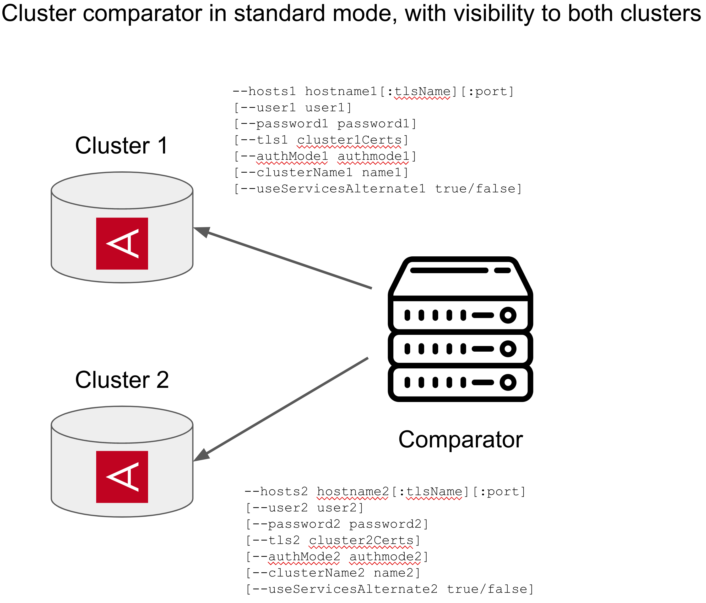
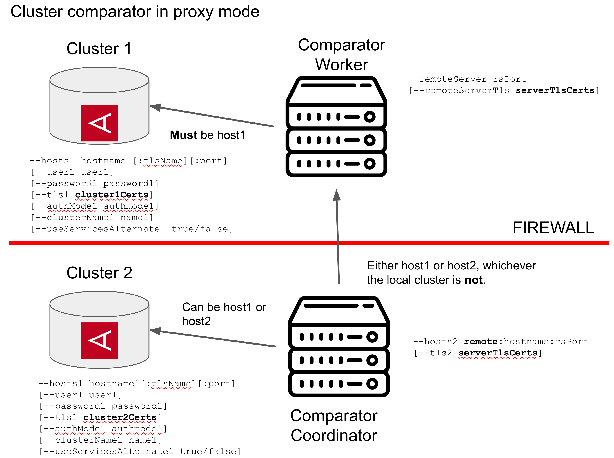

# cluster-comparator
## Purpose
This is a utility which allows 2 or more distinct Aerospike clusters to be compared and the results output to a CSV file or the console.

There are lots of options which can control how it does this, and how it handles any differences it finds. This behavior is primarily controlled by the `compareMode` parameter. This takes one of four values:

* **QUICK_NAMESPACE**: This option compares two namespaces for identical numbers of records and reports on the differences. This is done partition by partition so is a bit more thorough than just comparing the number of records in the namespace. However, it makes no attempt to identify which records are different. This option cannot take a set name as sets are co-mingled within the partitions

* **MISSING_RECORDS**: Identifies if the clusters have identical records, and if not which records are missing from which clusters.
* **RECORDS_DIFFERENT**: Identifies missing records from all clusters as with MISSING_RECORDS, but also compares record contents to ensure the contents of the records are identical. This mode will detect if the records are different but not show all the differences. The first difference will be output to the CSV file if this option has been selected.
* **RECORD_DIFFERENCES**: Same as RECORDS_DIFFERENT but records all the differences between the records that it finds.

## Architecture
The comparator can run in two modes, depending on the visibiltiy of the clusters to the comparator node.

### Comparator has visibility to both clusters

This is the most common usage and requires the comparator to have visibility to both clusters. In this case only one comparator is needed, and the various parameters which apply to each cluster like `--hosts1` and `--hosts2` can be used to control connectivity to the appropriate cluster.

### No node has visibility to both clusters

This mode is used in situations where firewalls and isolation rules prevent both clusters being visible to a single node. An example of this is comparing an on-premise cluster to a cloud-based cluster where the cloud-based cluster does not have public IP addresses and there is no VPN tunnel between the on-premise cluster and the cloud-based cluster.

In this mode, two comparator instances are need, each one having visibility to one cluster. One of these is designated as a controller, and the other is a worker. The controller has all the main options applied to is, such as the compare mode, action to take when differences are found, and so on. The worker simply grants visibility to the remote cluster.

The worker is started with `--remoteServer` parameter, and only uses the side 1 parameters to connect to the cluster it can see. (So, `--host1`, `--user1`, `--password1`, etc). The `--remoteServer` parameter takes one argument which is either a single port to listen on, or two ports separated by a comma. In this latter case, the first port is the communications port between the worker and controller, and the second port is a heartbeat port which just listens for connect requests and accepts them. This is useful for load-balancers which need some form of heartbeat to indicate health.

The communications between the controller and the worker can be encrypted using TLS if desired using the `--remoteServerTls` parameter. The stream of records between the 2 nodes can be buffered using `--remoteCacheSize` parameter which allows for more efficient communications. This value must be greater than 4 to be of any use, but depending on the network might be better set in the thousands.

There is another parameter `--remoteServerHashes` which is used to control the communications with the remote server. This is set true by default, and this will hash the records using RIPEMD160 hash and simply send the hash from the remote server to the comparator controller. This is substantially more efficient than sending the records due to lower network usage, and since it prevents having to serialize the record anyway and deserialize at the receiving end will probably lower CPU anyway. 

Typically this hashing will be done with `--remoteCacheSize` set to enable the most efficient communications. If using a compareMode of RECORDS_DIFFERENT the hash is all that is needed -- if the hashes are different, the records are different. However, if using RECORD_DIFFERENCES, the hash comparison will be performed. If the hashes are different, the actual records will be retrieved and compared. This transfer of the record from the remote server will *not* be cached, and will be issued as a separate call. Hence, if you have a clusters where you expect there to be a lot of differences, it might be better to turn off hashing.

People are often concerned about the hash based comparison. There is, after all, the chance of two dissimilar records having the same hash and resulting in a false negative. However, RIPEMD160 has no known collisions to date, and the probability of having 2 records with the same hash value is miniscule. How miniscule? Well, it's one in 2<sup>160</sup>, or about 1 in 1.46x10<sup>48</sup>. That's a big number. To put that in perspective, there are about 7.5x10<sup>17</sup> grains of sand on earth. The probability of willing the lottery is about 1 in 2.92x10<sup>8</sup>, so it's more than winning the lottery 5 times in a row. That's really, really, really miniscule.

Note that this method is designed for use where the visibility of the clusters is restricted. However, the hashing is so efficient that it might be worth using the remote server architecture if the clusters are a long way apart or have limited bandwidth between them. For example, if there is a cluster in San Francisco and another one in New York City, it would probably make sense to run the two comparator mode unless it was anticipated for them to have a significant number of record differences.

### Usage
```
usage: com.aerospike.comparator.ClusterComparator [<options>]
options:
-a,--action <arg>                Action to take. Options are: 'scan' (scan for differences), 'touch'
                                 (touch the records specified in the file), 'read' (read the records
                                 in specified file), , 'scan_touch' (scan for differences, if any
                                 differences then automatically touch the records), 'scan_read'
                                 (scan for differences, if any differences then automatically read
                                 the record), 'scan_ask' (scan for differences, if any differences
                                 then prompt the user, 'rerun' (read all the records from the
                                 previous run and see if they're still different. Requires an input
                                 file)as to whether to touch or read the records or not. Every
                                 options besides 'scan' MUST specify the 'file' option too.
                                 (Default: scan)
-a1,--authMode1 <arg>            Set the auth mode of cluster1. Default: INTERNAL
-a2,--authMode2 <arg>            Set the auth mode of cluster2. Default: INTERNAL
   --binsOnly                    When using RECORDS_DIFFERENT or RECORD_DIFFERENCES, do not list the
                                 full differences, just the bin names which are different
-C,--compareMode <arg>           Determine which sort of comparison to use. The options are:
                                 QUICK_NAMESPACE - Perform a quick (partition by partition count)
                                 comparison of an entire namespace. Cannot be used if migrations are
                                 going on or not all partitions are available. NOTE:This method
                                 compares object counts at a partition level, so is not always
                                 accurate. A partition which has record A on one side and record B
                                 on the other side would compareas equal for example. Also, since
                                 this compares partition by partition, comparison must be at the
                                 namesapce level, not the set level.
                                 MISSING_RECORDS (default) -- Check digests on both sides to find
                                 missing records. Does not compare record contents and does not need
                                 to read records off the drive. This is fast but will not detect if
                                 the contents of the records are different.
                                 RECORDS_DIFFERENT -- Runs through all records and detects both
                                 missing records on either side and if record contents themselves
                                 are different. This will read all the records off the drives to be
                                 able to compare contents. This will only detect that records are
                                 different and not show the record differences
                                 RECORD_DIFFERENCES -- Similar to RECORDS_DIFFERENT but will
                                 comprehensively inspect record pairs to determine the differences
                                 and show them.
-c,--console                     Output differences to the console. 'quiet' flag does not affect
                                 what is output. Can be used in conjunction with 'file' flag for
                                 dual output
-cf,--configFile <arg>           YAML file with config options in it
-cn1,--clusterName1 <arg>        Set the cluster name of cluster 1
-cn2,--clusterName2 <arg>        Set the cluster name of cluster 2
-D,--debug                       Turn on debug mode. This will output a lot of information and
                                 automatically turn on verbose mode and turn silent mode off
-db,--beginDate <arg>            Specify the begin date of the scan. Any records whose last update
                                 time is this time or greater will be included in the scan. The
                                 format of the date is by default yyyy/MM/dd-hh:mm:ssZ but can be
                                 changed with -df flag. If the parameter is a just a number this
                                 will be treated as the number of milliseconds since 1/1/1970. If
                                 the end date is also specified, only records falling between the 2
                                 dates will be scanned. Default: scan from the start of time.
-de,--endDate <arg>              Specify the end date of the scan. Any records whose last update
                                 time is less than or equal to this time will be included in the
                                 scan. The format of the date is by default yyyy/MM/dd-hh:mm:ssZ but
                                 can be changed with -df flag. If the parameter is a just a number
                                 this will be treated as the number of milliseconds since 1/1/1970.
                                 If the start date is also specified, only records falling between
                                 the 2 dates will be scanned. Default: scan until the end of time.
-df,--dateFormat <arg>           Format used to convert the dates passed with the -db and -de flags.
                                 Should conform to the spec of SimpleDateFormat.
-E,--endPartition <arg>          Partition to end the comparison at. The comparsion will not include
                                 this partition. (Default: 4096)
-f,--file <arg>                  Path to a CSV file. If a comparison is run, this file will be
                                 overwritten if present.
-h1,--hosts1 <arg>               List of seed hosts for first cluster in format:
                                 hostname1[:tlsname][:port1],...
                                 The tlsname is only used when connecting with a secure TLS enabled
                                 server. If the port is not specified, the default port is used.
                                 IPv6 addresses must be enclosed in square brackets.
                                 Default: localhost
                                 Examples:
                                 host1
                                 host1:3000,host2:3000
                                 192.168.1.10:cert1:3000,[2001::1111]:cert2:3000
-h2,--hosts2 <arg>               List of seed hosts for second cluster in format:
                                 hostname1[:tlsname][:port1],...
                                 The tlsname is only used when connecting with a secure TLS enabled
                                 server. If the port is not specified, the default port is used.
                                 IPv6 addresses must be enclosed in square brackets.
                                 Default: localhost
                                 Examples:
                                 host1
                                 host1:3000,host2:3000
                                 192.168.1.10:cert1:3000,[2001::1111]:cert2:3000
-i,--inputFile <arg>             Specify an input file for records to compare. This is only used
                                 with the RERUN, READ and TOUCH actions and is typically set to the
                                 output file of a previous run.
-l,--limit <arg>                 Limit the number of differences to the passed value. Pass 0 for
                                 unlimited. (Default: 0)
-m,--metadataCompare             Perform a meta-data comparison between the 2 clusters
-n,--namespaces <arg>            Namespaces to scan for differences. Multiple namespaces can be
                                 specified in a comma-separated list. Must include at least one
                                 namespace.
-P1,--password1 <arg>            Password for cluster 1
-P2,--password2 <arg>            Password for cluster 2
-pf,--pathOptionsFile <arg>      YAML file used to contain path options. The options are used to
                                 determine whether to ignore paths or compare list paths order
                                 insensitive.
-pl,--partitionList <arg>        Specify a list of partitions to scan. If this argument is
                                 specified, neither the beginPartition nor the endPartition argument
                                 can be specified
-q,--quiet                       Do not output spurious information like progress.
-r,--rps <arg>                   Limit requests per second on the cluster to this value. Use 0 for
                                 unlimited. (Default: 0)
-rcs,--remoteCacheSize <arg>     When using a remote cache, set a buffer size to more efficiently
                                 transfer records from the remote server to this comparator. Note
                                 this parameter only has an effect if >= 4
-rl,--recordLimit <arg>          The maximum number of records to compare. Specify 0 for unlimited
                                 records (default)
-rs,--remoteServer <arg>         This comparator instance is to be used as a remote server. That is,
                                 its operations will be controlled by another comparator instance,
                                 and they will communicate over a socket. Note that in this mode,
                                 only host 1 is connected, any parameters associated with host 2
                                 will be silently ignored. This is useful when there is no single
                                 node which can see both clusters due to firewalls, NAT restrictions
                                 etc. To connect to this remoteServer from the main comparator
                                 specify a host address of 'remote:<this_host_ip>:<port>. The port
                                 is specified as a parameter to this argument. If using TLS, the
                                 -remoteServerTls parameter is also required for the server to get
                                 the appropriate certificates.
                                 This argument takes 1 or 2 parameters in the format
                                 port,[heartbeatPort]. If the heartbeat port is specified, it is
                                 non-TLS enabled and just accepts connections then echoes back any
                                 characters received. It can only handle one heartbeat at a time.
-rsh,--remoteServerHashes <arg>  When using the remote server, send hashes for record comparison.
                                 Default: true. Turning this to false might be more efficient if you
                                 are finding record level differences and there are a lot of
                                 mismatching records.
-rst,--remoteServerTls <arg>     TLS options for the remote server. Use the same format as -tls1,
                                 but only the context is needed
-S,--startPartition <arg>        Partition to start the comparison at. (Default: 0)
-s,--setNames <arg>              Set name to scan for differences. Multiple sets can be specified in
                                 a comma-separated list. If not specified, all sets will be scanned.
-sa1,--useServicesAlternate1     Use services alternative when connecting to cluster 1
-sa2,--useServicesAlternate2     Use services alternative when connecting to cluster 2
   --showMetadata                Output cluster metadata (Last update time, record size) on cluster
                                 differernces. This will require an additional read which will
                                 impact performance
-sm,--sortMaps <arg>             Sort maps. If using hashes to compare a local cluster with a remote
                                 cluster and the order in the maps is different, the hashes will be
                                 different. This can lead to false positives, especially when using
                                 RECORDS_DIFFERENT which relies on the hashes being accurate.
                                 RECORD_DIFFERENCES mode is not susceptible to this as it first
                                 compares hashes and if they're different will transfer the whole
                                 record and find any differences. Hence if the hash is wrong due to
                                 order differences but the contents are identical, no record will be
                                 flagged in this mode. This flag will cause more CPU usage on both
                                 the remote comparator and the main comparator but will make sure
                                 the hashes are consistent irrespective of the underlying order of
                                 any maps. This flag only makes sense to set when using a remote
                                 comparator, especially with RECORDS_DIFFERENT mode. Default is
                                 false,unless using a remote server with RECORDS_DIFFERENT mode and
                                 remoteServerHashes set to true.
-t,--threads <arg>               Number of threads to use. Use 0 to use 1 thread per core. (Default:
                                 1)
-t1,--tls1 <arg>                 Set the TLS Policy options on cluster 1. The value passed should be
                                 a JSON string. Valid keys in this string inlcude 'protocols',
                                 'ciphers', 'revokeCerts', 'context' and 'loginOnly'. For 'context',
                                 the value should be a JSON string which can contain keys
                                 'certChain' (path to the certificate chain PEM), 'privateKey' (path
                                 to the certificate private key PEM), 'caCertChain' (path to the CA
                                 certificate PEM), 'keyPassword' (password used for the certificate
                                 chain PEM), 'tlsHost' (the tlsName of the Aerospike host). For
                                 example: --tls1
                                 '{"context":{"certChain":"cert.pem","privateKey":"key.pem","caCertC
                                 hain":"cacert.pem","tlsHost":"tls1"}}'
-t2,--tls2 <arg>                 Set the TLS Policy options on cluster 2. The value passed should be
                                 a JSON string. Valid keys in thisstring inlcude 'protocols',
                                 'ciphers', 'revokeCerts', 'context' and 'loginOnly'. For 'context',
                                 the value should be a JSON string which can contain keys
                                 'certChain' (path to the certificate chain PEM), 'privateKey' (path
                                 to the certificate private key PEM), 'caCertChain' (path to the CA
                                 certificate PEM), 'keyPassword' (password used for the certificate
                                 chain PEM), 'tlsHost' (the tlsName of the Aerospike host). For
                                 example: --tls2
                                 '{"context":{"certChain":"cert.pem","privateKey":"key.pem","caCertC
                                 hain":"cacert.pem","tlsHost":"tls2"}}'
-u,--usage                       Display the usage and exit.
-U1,--user1 <arg>                User name for cluster 1
-U2,--user2 <arg>                User name for cluster 2
-V,--verbose                     Turn on verbose logging, especially for cluster details and TLS
                                 connections
```
The most significant options are:
* -h1, h2: Specify the clusters to connect to
* -n: The namespace(s) to compare, a comma separated list
* -s: The sets to compare, if desired. This is an optional comma separated list
* -C: The compare mode to use. This can be quick (comparing record counts on a per-partition basis and only compare those that are different) all the way through to a complete records level comparison)
* -a: The action to take. Should the records be scanned, or scanned and then touched if they're missing for example
* -t: The number of threads. 

## Options for path-specific actions
One of the arguments to the comparator is a path options configuration file, specified with the `-pf` parameter. The argument to this parameter is the name of a YAML file, and there are two main options which can be specified. These are:
1. **compareUnordered**: This option specifies that the order of the specified list does not matter, so the lists [1,2,3] and [2,3,1] should be compared as equal. The default is that list ordering is important and cannot be ignored. This option is ignored for anything which is not a list
2. **ignore**: Any item flagged with `ignore` will not be found different.

The option is associated with a path. The format of the path is `/namespace/set/binName/pathPart`. The `pathPart` is optional and can be used to nest into lists and maps (CDTs). For example, `/test/testSet/name` refers to the `name` bin in the `testSet` set in the `test` namespace and `/test/testSet/name/1/def` refers to a map key of `def` in the second item of the list (lists are 0-based indexes) in the bin `name` in set `testSet` in namespace `test`.

There are 2 `glob`s that are supported: `*` and `**`. `*` matches any single item in the path, and `**` matches any number of parts in a path. So `/**/ignore` will match a bin in any namespace or set called `ignore` or any map key called `ignore` so long as they're at the end of the path. `/**/ignore/**` will match any path which includes `ignore` anywhere.

The combination of path and action are put into the YAML file. So an example YAML would be:

```
---
paths:
- path: /test/testSet/unordered1
  action: compareUnordered
- path: /**/ignore
  action: ignore
```

## Comparing more than 2 clusters
The comparator has the ability to compare an arbitrary number of clusters. In order to do this, the cluster connection options must be specified in a config YAML file and *cannot* be specified on the command line. This is separate from the path YAML file above. This file is specified with `--configFile` or `-cf` option. At the moment this config file can only take the cluster connection details and namespace mapping details, but in future it will be able to take all options. 

So a simple example might be:

```
---
clusters:
- hostName: 172.17.0.2:3100
  authMode: INTERNAL
- hostName: 172.17.0.3:3101
- hostName: 172.17.0.4:3102
```

This gives details of 3 clusters to connect, however 2 or more clusters can be compared. The larger the number of clusters, the longer the comparison with take. For example, if there are 4 clusters, A,B,C,D and the compare mode is `RECORD_DIFFERENCES`, the comparator will load each record from the 4 clusters then compare: A<->B, A<->C, A<->D, B<->C, B<->D, C<->D

This is a simple example, but you can specify any options you want. For example to use `tls`:

```yaml
---
clusters:
- hostName: 172.24.162.8:tlsName:4333
  tls:
    ssl:
      certChain: server.pem
      privateKey: server.key
      caCertChain: rootCA.pem
- hostName: as49n1:3000
- hostName: as49n2:3000
```

Each host can take the following parameters:
`hostName`
`clusterName`
`userName`
`password` (If not provided but a userId is provided, this should be prompted for, but I didn’t test this for > 2 clusters)
`authMode`
`useServicesAlternate`
`tls`

`TLS` is an object which can take:
`protocols`
`ciphers`
`revokeCertificates`
`loginOnly`
`ssl`

`SSL` is also an object which can take

`certChain`
`privateKey`
`caCertChain`
`keyPassword`

If a configuration file is provided with host connectivity details, the connection command line options like `--hosts1`, `--hosts2`, `--authMode1`, `--user1`, `--password1`, `--tls1`, `--clusterName1`, `--useServicesAlternate1` and so on cannot be specified.

## Comparing different namespaces
Sometimes it is desired to compare records in different namespaces in different clusters. For example, there may be a `stage` namespace on a staging cluster and a `prod` namespace on a production cluster, but the two should have the same data. This can be achieved using the `namespaceMapping` section of the configuration file. (`--configFile` option).

This part of the config file looks like:

```yaml
namespaceMapping:
- namespace: test
  mappings:
  - clusterName: dest1
    name: bar
```

In this case when the namespace `test` is being compared between clusters, all clusters will use the `test` namespace except for the cluster with the name `dest1`, where the records will be compared to the `bar` namespace. When this option is used, the comparator will print lines at the start of the comparison similar to:

```
  Namespace "test" is known as "bar" on cluster "dest1"
```

(Note that these lines will not be printed if the `--silent` option has been specified, or if a namespace has been mapped to the same name. For example, mapping namespace `test` to a name of `test`.)

In the above example, the `clusterName` parameter was passed to determine which namespace was being referenced. However, it is equally valid to pass the index of the cluster, starting with index 1 through the `clusterIndex` parameter. Note that if both `clusterName` and `clusterIndex` are specified and they do not refer to the same cluster, an error will be printed and the comparison aborted.

An example including both cluster connection details and namespace mapping in the config file is:

```yaml
---
clusters:
- hostName: 172.17.0.2:3100
  authMode: INTERNAL
  clusterName: test
- hostName: 172.17.0.3:3101
  clusterName: stage
- hostName: 172.17.0.4:3102
  clusterName: prod
namespaceMapping:
- namespace: customer
  mappings:
  - clusterName: test
    name: testCust
  - clusterName: stage
    name: stageCust
  - clusterName: prod
    name: prodCust
```

It is recommended to use cluster names wherever possible for ease of understanding and ensuring the correct cluster is connected to. For information on cluster names, please see [cluster-name](https://aerospike.com/docs/server/reference/configuration/?context=all&version=7&search=cluster-name#service__cluster-name) in the Aerospike Reference documentation.

## Implementation
This comparator uses the `scanPartitions` method to go through all 4,096 partitions in a cluster and scan them. `scanPartitions` is very useful as it returns the digests for a particular partition in digest order. If we consider comparing a single partition, we have a connection to each one of the 2 clusters and we know that the same record (digest) will always appear in the same partition on both clusters. Since the digests are returned in sorted order, we effectively have 2 very large sorted lists of items we need to compare. 

The internals of the comparison are therefore very easy. This is in the `comparePartition` method whose code resembles:

```java
boolean side2Valid = getNextRecord(recordSet2, 2);
boolean side1Valid = getNextRecord(recordSet1, 1);
while ((side1Valid || side2Valid)) {
    Key key1 = side1Valid ? recordSet1.getKey() : null;
    Key key2 = side2Valid ? recordSet2.getKey() : null;
    if (key1 == null) {
        missingRecord(client2, partitionId, key2, true);
        side2Valid = getNextRecord(recordSet2, 2);
    }
    else if (key2 == null) {
        missingRecord(client1, partitionId,key1, false);
        side1Valid = getNextRecord(recordSet1, 1);
    }
    else {
        int result = compare(key1.digest, key2.digest);
        if (result < 0) {
            // The digests go down as we go through the partition, so if side 2 is > side 1
            // it means that side 1 has missed this one and we need to advance side2
            missingRecord(client2, partitionId, key2, true);
            side2Valid = getNextRecord(recordSet2, 2);
        }
        else if (result > 0) {
            // The digests go down as we go through the partition, so if side 1 is > side 2
            // it means that side 2 has missed this one and we need to advance side1
            missingRecord(client1, partitionId, key1, false);
            side1Valid = getNextRecord(recordSet1, 1);
        }
        else {
            if (options.isRecordLevelCompare()) {
                Record record1 = recordSet1.getRecord();
                Record record2 = recordSet2.getRecord();
                DifferenceSet compareResult = comparator.compare(record1, record2, 
                        options.getCompareMode() == CompareMode.RECORDS_DIFFERENT);
                if (compareResult.areDifferent()) {
                    differentRecords(partitionId, key2, null, null, compareResult);
                }
            }
            // The keys are equal, move on.
            side2Valid = getNextRecord(recordSet2, 2);
            side1Valid = getNextRecord(recordSet1, 1);
        }
    }
}
```

Scanning a single partition requires only a single server-side thread -- there is no parallelization across a partition by multiple query threads. It would be possible for the client to perform a scan of all 4,096 server partitions concurrently which would utilize more server-side query threads but this would make the client more complex as all concurrent scans will be interleaved in the client result set. 

Hence, concurrency is controlled by the client. Each thread will scan one partition before moving onto the next partition. There can be multiple concurrent client threads scanning different partitions, each of which will consume one server-side scan thread for each of the clusters.

For more details on this please see the blog [here](https://developer.aerospike.com/blog/comparing-aerospike-clusters-using-querypartitions).

### Examples

```
-h1 172.17.0.2 -h2 172.17.0.3 -n test -s cars -a scan -f /tmp/output.csv -c -C RECORD_DIFFERENCES -t 0
```

Compare the `cars` set in the `test` namespace, using one thread per client-side core. Differences are output to `/tmp/output.csv`