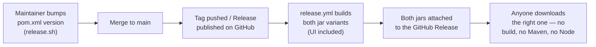

# Aerospike Cluster Comparator

## Overview

The Aerospike Cluster Comparator is a powerful utility for comparing data between two or more Aerospike clusters. It helps you verify data consistency, identify missing or different records, and take corrective actions across distributed environments.

## 📥 Getting the Jar

Every tagged release publishes two ready-to-run jars — web UI included — to this repo's [GitHub Releases](../../releases). **Most people should start there, not by building from source** — this is what makes the tool usable for anyone who can't build it themselves, e.g. behind a corporate firewall (see [Building From Source](#-building-from-source) below for why building can fail in that situation).


```mermaid
flowchart LR
    A["Maintainer bumps\npom.xml version\n(release.sh)"] --> B["Merge to main"]
    B --> C["Tag pushed / Release\npublished on GitHub"]
    C --> D["release.yml builds\nboth jar variants\n(UI included)"]
    D --> E["Both jars attached\nto the GitHub Release"]
    E --> F["Anyone downloads\nthe right one — no\nbuild, no Maven, no Node"]
```

1. A maintainer bumps the version and merges it to `main`, then tags that commit and publishes a GitHub Release for it (see [Cutting a Release](#cutting-a-release-maintainers) below).
2. That tag automatically triggers [`.github/workflows/release.yml`](.github/workflows/release.yml), which builds both jar variants and attaches them to the release — no one needs to build anything for this to happen.
3. Anyone — including customers with no Maven/Node access at all — downloads the finished jar that matches their JDK straight from the [Releases page](../../releases) and runs it.

### Which jar do I need?

| Jar | Requires | Use it if |
|-----|----------|-----------|
| `ClusterComparator-X.Y.Z-jdk11-full.jar` | JDK 11 or newer | This is the one almost everyone wants — it runs on JDK 11, 21, and anything newer. |
| `ClusterComparator-X.Y.Z-jdk21-full.jar` | JDK 21 or newer only | You're specifically on JDK 21+ and want Aerospike's newer-JVM-optimized client. Functionally equivalent to the jdk11 jar otherwise. |

There's no separate JDK 8 build today — see [Building From Source](#-building-from-source) for why (Javalin, the embedded web UI server, itself requires JDK 11+). If you need this on JDK 8, say so in an issue.

Only continue to [Building From Source](#-building-from-source) if a release doesn't yet exist for what you need, or you're modifying the code yourself.

## 🚀 Quick Start

### Basic Comparison
Compare records between two clusters and output differences to a CSV file:

```bash
java -jar cluster-comparator.jar \
  --hosts1 cluster1.example.com:3000 \
  --hosts2 cluster2.example.com:3000 \
  --namespaces test \
  --action scan \
  --file differences.csv \
  --console
```

### Common Use Cases at a Glance

| Scenario | Command | When to Use |
|----------|---------|-------------|
| **Quick Health Check** | `--action scan --compareMode QUICK_NAMESPACE` | Fast partition-level comparison |
| **Find Missing Records** | `--action scan --compareMode MISSING_RECORDS` | Default mode, finds missing records |
| **Verify Data Integrity** | `--action scan --compareMode RECORDS_DIFFERENT` | Detects content differences |
| **Detailed Differences** | `--action scan --compareMode RECORD_DIFFERENCES` | Shows specific field differences |
| **Fix Missing Data** | `--action scan_touch` | Automatically touch missing records |
| **Time-filtered scan** | `--beginDate "…" [--endDate "…"]` | Compare only records updated in a window; see [Use Cases § 8](docs/use-cases.md#8-validate-recent-xdr-replication) |

### Essential Parameters
```bash
# Connection
--hosts1 cluster1:3000 --hosts2 cluster2:3000

# Authentication  
--user1 readonly --password1 secret

# Scope
--namespaces production --setNames users,cache

# Performance
--threads 4 --rps 1000

# Output
--file differences.csv --console
```

Time-filtered comparisons add `--beginDate` and optionally `--endDate`; see [Validate Recent XDR Replication](docs/use-cases.md#8-validate-recent-xdr-replication) and the **Time Range** row in [Quick Reference](docs/reference.md).

| Document | Description |
|----------|-------------|
| **[How the Comparator Works](docs/how-it-works.md)** | How scans, modes, date filters, set mapping, and batch lookups behave |
| **[Use Cases & Scenarios](docs/use-cases.md)** | Real-world examples and step-by-step workflows |
| **[Architecture & Deployment](docs/architecture.md)** | Network architectures and deployment patterns |
| **[Comparison Modes](docs/comparison-modes.md)** | Detailed explanation of all comparison modes |
| **[Configuration](docs/configuration.md)** | Configuration files, path options, multi-cluster setup |
| **[Web Interface](docs/web-ui.md)** | Optional browser-based UI for configuring and monitoring comparisons |
| **[Troubleshooting & Performance](docs/troubleshooting.md)** | Common issues, optimization, and security |
| **[Quick Reference](docs/reference.md)** | Command patterns, parameters, and examples |

## 🔧 Building From Source

Prebuilt jars (with the web UI included) are attached to each [GitHub Release](../../releases) — check there first if you'd rather not build at all.

If you don't already have `cluster-comparator.jar`, build it with:

```bash
./mvnw clean package -DskipUi
```

The included [Maven wrapper](https://maven.apache.org/wrapper/) (`mvnw` / `mvnw.cmd`) means you don't need Maven installed locally — it downloads the right Maven version itself the first time you run it. If you already have Maven installed, `mvn clean package -DskipUi` works the same way.

The jar (`target/ClusterComparator-<version>-jdk11-full.jar`) includes everything, including a working web UI — this command uses the pre-built UI assets already committed to the repo, so it needs nothing beyond normal Maven dependency access (no Node.js, no npm). **This is the build to use behind a corporate firewall or proxy.**

Only drop `-DskipUi` if you're actively developing the web UI and need to regenerate it from source — that path downloads Node.js and npm packages from the internet and is commonly blocked by corporate firewalls. See [Building the Web Interface](docs/web-ui.md#building) for details.

### Supported JDK versions

The default build above targets JDK 11+ (see [Which jar do I need?](#which-jar-do-i-need) above) and depends on `aerospike-client-jdk8` — Aerospike's Java-8-bytecode client, which is forward-compatible with any newer JRE. Build the JDK 21-optimized variant instead with:

```bash
./mvnw clean package -DskipUi -Pjdk21
```

which switches to `aerospike-client-jdk21` and compiles with `--release 21`, producing `ClusterComparator-<version>-jdk21-full.jar` (requires a JDK 21+ JRE to run).

There's no JDK 8 build today: this project's own code is JDK 8-compatible, but Javalin (the web UI's embedded server) is itself compiled for Java 11+ — Javalin's Java-8-compatible line stops at its 4.x releases, several majors behind the version this project uses. Supporting JDK 8 would mean either downgrading Javalin (real API-compatibility risk) or shipping a CLI-only build without the web UI for that JDK; neither has been done yet.

### Cutting a Release (Maintainers)

1. Bump `<version>` in `pom.xml` to the release version. [`release.sh`](release.sh) does this for you:
   ```bash
   ./release.sh patch   # or: minor, major, or an explicit version like 2.0.0-rc1
   ```
   It only edits `pom.xml` — it prints the exact remaining commands (commit, push, open a PR) rather than running them for you.
2. Merge that PR to `main`.
3. On GitHub, go to **Releases → Draft a new release**, create a tag matching the version (e.g. `v1.3.0`) targeting `main`, and publish.

Publishing the release creates and pushes the tag, which triggers [`.github/workflows/release.yml`](.github/workflows/release.yml): it builds both jar variants (see [Which jar do I need?](#which-jar-do-i-need)) and attaches both to that same release. The workflow verifies `pom.xml`'s version matches the tag and fails with a clear error if you tag before bumping it — the version bump has to land on `main` first so the tag and the released jars always match what you'd get rebuilding that same tag yourself.

## 🔄 Basic Workflow

1. **Choose your comparison mode** based on your needs (see [How the Comparator Works](docs/how-it-works.md) for behaviour, [Comparison Modes](docs/comparison-modes.md) for choosing):
   - `QUICK_NAMESPACE` for fast health checks
   - `MISSING_RECORDS` for finding missing data (default)
   - `RECORDS_DIFFERENT` for content verification
   - `RECORD_DIFFERENCES` for detailed analysis

2. **Select an action**:
   - `scan` to identify differences
   - `scan_touch` to automatically fix missing records
   - `touch`/`read` to process existing difference files

3. **Configure scope and performance**:
   - Set namespaces and optionally specific sets
   - Adjust threads and rate limiting for your environment

## 🚨 Important Notes

⚠️ **Before Using Delete Actions:**
- Always test with `--limit` first
- Use `scan` action before any destructive operations
- Understand XDR propagation implications
- Consider using `--skipChallenge false` for safety prompts

🔐 **Security Best Practices:**
- Use read-only accounts when possible
- Enable TLS for production environments
- Store credentials in environment variables
- Validate configurations with test runs

## 📋 Quick Command Examples

### Health Check
```bash
java -jar cluster-comparator.jar \
  --hosts1 primary:3000 --hosts2 replica:3000 \
  --namespaces production \
  --action scan \
  --compareMode QUICK_NAMESPACE \
  --console
```

### Find Missing Records
```bash
java -jar cluster-comparator.jar \
  --hosts1 source:3000 --hosts2 target:3000 \
  --namespaces userdata \
  --action scan \
  --compareMode MISSING_RECORDS \
  --file missing.csv \
  --console
```

### Auto-Fix Missing Data
```bash
java -jar cluster-comparator.jar \
  --hosts1 primary:3000 --hosts2 replica:3000 \
  --namespaces production \
  --action scan_touch \
  --file results.csv
```

## 🔗 Getting Help

- **All command line options**: See [📋 Complete Command Line Options](docs/reference.md#-complete-command-line-options) for comprehensive list
- **Built-in help**: `java -jar cluster-comparator.jar --usage`
- **Debug mode**: Add `--debug` flag for detailed logging
- **Test configuration**: Use `--limit 10` for small test runs

For detailed documentation on specific topics, see the links above.

---

**📖 For comprehensive examples and advanced usage, start with [Use Cases & Scenarios](docs/use-cases.md)**