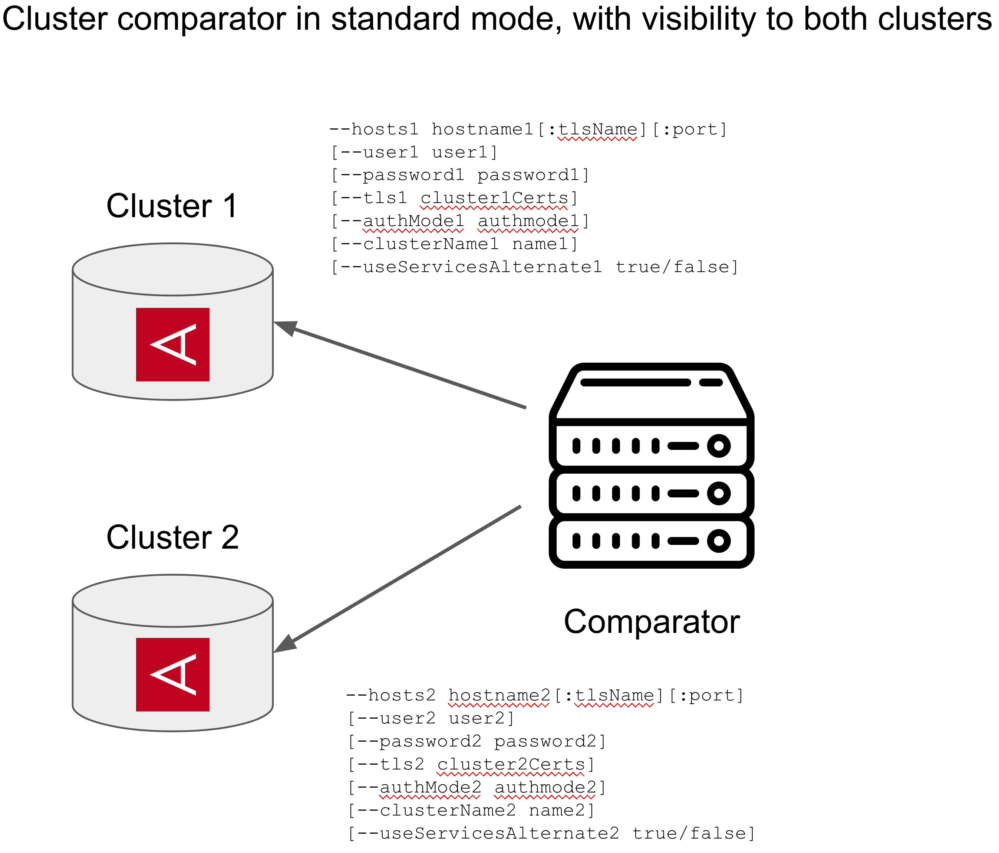

# Architecture & Deployment

## 📚 Documentation Navigation
| [🏠 Home](../README.md) | [📋 Use Cases](use-cases.md) | [🔍 Comparison Modes](comparison-modes.md) | [⚙️ Configuration](configuration.md) | [🚨 Troubleshooting](troubleshooting.md) | [📋 Reference](reference.md) |
|---|---|---|---|---|---|

---

This document explains the different deployment architectures and network configurations for the Aerospike Cluster Comparator.

## 🏗️ Deployment Architectures

The Aerospike Cluster Comparator can run in two distinct modes, depending on network visibility between clusters.

### Standard Mode (Direct Access)


**Use when:**
- Single machine can reach both clusters
- VPN connections exist between environments  
- Clusters are in the same network/datacenter
- No firewall restrictions between comparator and clusters

**Basic Configuration:**
```bash
java -jar cluster-comparator.jar \
  --hosts1 cluster1:3000 \
  --hosts2 cluster2:3000 \
  --namespaces production \
  --action scan
```

**With Authentication & TLS:**
```bash
java -jar cluster-comparator.jar \
  --hosts1 secure-cluster1:tls1:4333 \
  --tls1 '{"context":{"certChain":"client1.pem","privateKey":"client1.key","caCertChain":"ca1.pem"}}' \
  --user1 readonly --password1 secure1 \
  --hosts2 secure-cluster2:tls2:4333 \
  --tls2 '{"context":{"certChain":"client2.pem","privateKey":"client2.key","caCertChain":"ca2.pem"}}' \
  --user2 readonly --password2 secure2 \
  --namespaces production \
  --action scan
```

### Remote Server Mode (Proxy Architecture)  


**Use when:**
- On-premise to cloud comparisons without VPN
- Strict firewall policies between environments
- Air-gapped or isolated networks
- Cross-datacenter with limited connectivity

**Components:**
- **Controller**: Manages comparison logic and results
- **Worker**: Provides access to isolated cluster

**Setup Process:**

**Step 1 - Start Worker (on machine with cluster1 access):**
```bash
java -jar cluster-comparator.jar \
  --hosts1 isolated-cluster:3000 \
  --user1 readonly \
  --password1 secret \
  --remoteServer 8080,8081 \
  --remoteServerTls '{"context":{"certChain":"server.pem","privateKey":"server.key"}}'
```

**Step 2 - Run Controller (on machine with cluster2 access):**
```bash
java -jar cluster-comparator.jar \
  --hosts1 remote:worker-machine-ip:8080 \
  --hosts2 accessible-cluster:3000 \
  --user2 readonly \
  --password2 secret \
  --namespaces production \
  --action scan \
  --remoteCacheSize 1000
```

## ⚡ Remote Server Optimization

### Hash-Based Comparison
**Default Behavior (`--remoteServerHashes true`):**
- Uses RIPEMD160 hashing by default
- Reduces network traffic by ~95% compared to full record transfer
- Collision probability: 1 in 2¹⁶⁰ (astronomically small)
- Only transfers full records when hashes differ

**Performance Benefits:**
- **Network efficiency**: Hash comparison uses minimal bandwidth
- **CPU efficiency**: Avoids record serialization overhead  
- **Scalability**: Handles millions of records efficiently

### Buffering (`--remoteCacheSize`)
- Batches operations for network efficiency
- Recommended values: 1000-10000 depending on network latency
- Must be ≥4 to be effective
- Higher values better for high-latency networks

### Example Optimized Remote Setup
```bash
# Worker (high-performance settings)
java -jar cluster-comparator.jar \
  --hosts1 isolated-cluster:3000 \
  --remoteServer 8080,8081 \
  --remoteServerTls '{"context":{"certChain":"server.pem","privateKey":"server.key"}}' \
  --verbose

# Controller (optimized for network efficiency)  
java -jar cluster-comparator.jar \
  --hosts1 remote:worker-host:8080 \
  --hosts2 accessible-cluster:3000 \
  --namespaces production \
  --action scan \
  --compareMode RECORDS_DIFFERENT \
  --remoteCacheSize 5000 \
  --remoteServerHashes true \
  --threads 4
```

## 🔧 Architecture Decision Matrix

| Scenario | Recommended Mode | Key Benefits | Considerations |
|----------|------------------|--------------|----------------|
| Same datacenter | Standard | Simple setup, best performance | Direct network access required |
| VPN connected | Standard | Direct access, easier troubleshooting | VPN stability important |
| Cross-cloud without VPN | Remote Server | Overcomes connectivity restrictions | Requires two machines |
| High-latency networks | Remote Server | Hash-based efficiency | Benefits from caching |
| Firewall restrictions | Remote Server | Works through proxy pattern | Port configuration needed |
| Air-gapped networks | Remote Server | Isolated network access | Security compliance friendly |

## 🛡️ Security Considerations

### Standard Mode Security
```bash
# Use TLS for both connections
java -jar cluster-comparator.jar \
  --hosts1 secure-cluster1:tls1:4333 \
  --tls1 '{"context":{"certChain":"client1.pem","privateKey":"client1.key","caCertChain":"ca1.pem"}}' \
  --hosts2 secure-cluster2:tls2:4333 \
  --tls2 '{"context":{"certChain":"client2.pem","privateKey":"client2.key","caCertChain":"ca2.pem"}}' \
  --user1 readonly --password1 secure1 \
  --user2 readonly --password2 secure2
```

### Remote Server Mode Security  
```bash
# Worker with TLS
java -jar cluster-comparator.jar \
  --hosts1 secure-cluster:tls1:4333 \
  --tls1 '{"context":{"certChain":"client.pem","privateKey":"client.key"}}' \
  --remoteServer 8443 \
  --remoteServerTls '{"context":{"certChain":"server.pem","privateKey":"server.key"}}'

# Controller with TLS to both remote server and local cluster
java -jar cluster-comparator.jar \
  --hosts1 remote:worker-host:8443 \
  --hosts2 secure-cluster2:tls2:4333 \
  --tls2 '{"context":{"certChain":"client2.pem","privateKey":"client2.key"}}'
```

### Authentication Best Practices
```bash
# Use environment variables for credentials
export CLUSTER1_USER=readonly_user
export CLUSTER1_PASSWORD=secure_password
export CLUSTER2_USER=readonly_user  
export CLUSTER2_PASSWORD=secure_password

java -jar cluster-comparator.jar \
  --user1 "$CLUSTER1_USER" --password1 "$CLUSTER1_PASSWORD" \
  --user2 "$CLUSTER2_USER" --password2 "$CLUSTER2_PASSWORD" \
  --action scan \
  # ... other parameters
```

## 🔍 Hash Collision Probability Context

The chance of RIPEMD160 hash collision is 1 in 1.46×10⁴⁸. To put this in perspective:

| Comparison | Probability |
|------------|-------------|
| **Grains of sand on Earth** | ~7.5×10¹⁷ |
| **Atoms in human body** | ~7×10²⁷ |
| **Winning lottery 5 times in row** | ~2.4×10⁴⁰ |
| **RIPEMD160 hash collision** | **1.46×10⁴⁸** |

The risk is negligible for any practical dataset. You're more likely to win the lottery 5 times in a row than encounter a hash collision.

## 📊 Performance Characteristics

### Standard Mode Performance
```
Network Overhead: None (direct connections)
CPU Overhead: Minimal (direct record comparison)
Memory Usage: Low (streaming comparison)
Scalability: Excellent (limited by cluster capacity)
```

### Remote Server Mode Performance  
```
Network Overhead: ~5% (with hashing enabled)
CPU Overhead: Low (hash comparison + occasional full record)
Memory Usage: Medium (buffering + caching)
Scalability: Very Good (network efficient)
```

## 🚀 Implementation Details

### Technical Implementation
The comparator uses Aerospike's `queryPartitions` API for efficient partition-by-partition scanning:

1. **Partition Iteration**: Processes all 4,096 partitions systematically
2. **Digest Ordering**: Leverages sorted digest order for efficient comparison
3. **Merge Algorithm**: Uses two-pointer technique like merging sorted arrays
4. **Parallelization**: Client-side threading across partitions

### Concurrency Model
- Each thread processes one partition at a time
- No server-side parallelization within partitions
- Configurable thread count based on cluster capacity
- Rate limiting to prevent cluster overload

---

**Next:** Learn about [Comparison Modes](comparison-modes.md) to choose the right comparison strategy.