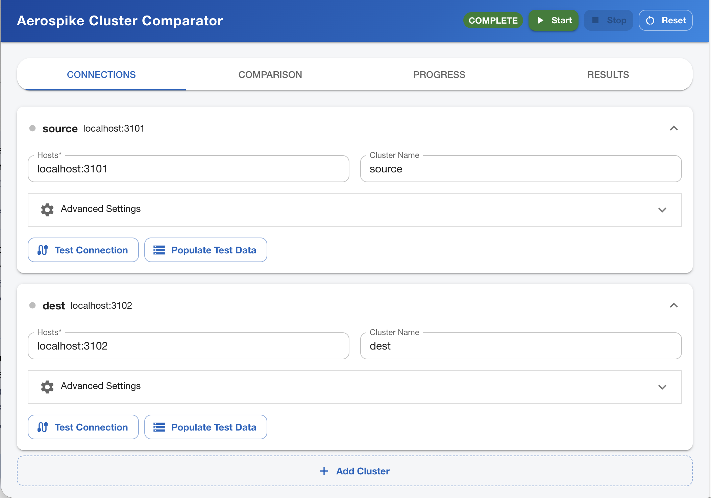
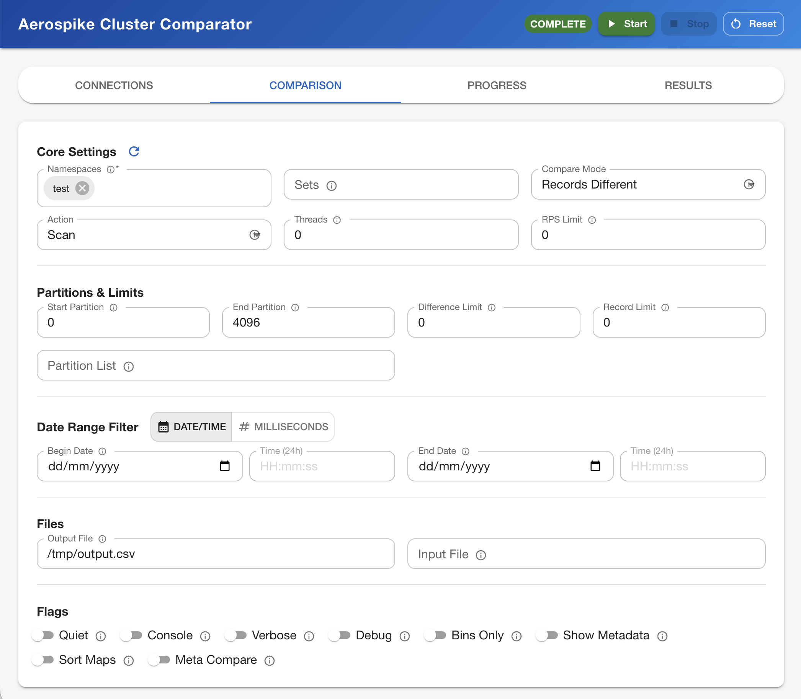

# Web Interface

## 📚 Documentation Navigation
| [🏠 Home](../README.md) | [📋 Use Cases](use-cases.md) | [🏗️ Architecture](architecture.md) | [🔍 Comparison Modes](comparison-modes.md) | [⚙️ Configuration](configuration.md) | [🚨 Troubleshooting](troubleshooting.md) | [📋 Reference](reference.md) |
|---|---|---|---|---|---|---|

---

The Aerospike Cluster Comparator includes an optional web-based user interface that provides a graphical way to configure, run, and monitor comparisons. The UI is a single-page React application served by an embedded web server.

## Starting the Web Interface

To launch the web interface, use the `--webInterfacePort` (`-wip`) parameter:

```bash
java -jar cluster-comparator.jar --webInterfacePort 8085
```

Then open `http://localhost:8085` in your browser. The comparator will not start a command-line comparison when the web interface is active — all operations are controlled through the UI.

### Pre-populating Options

You can pass other command-line options alongside `--webInterfacePort`. These will be pre-populated in the UI but the comparison will not start automatically:

```bash
java -jar cluster-comparator.jar \
  --webInterfacePort 8085 \
  --hosts1 cluster1:3000 \
  --hosts2 cluster2:3000 \
  --namespaces production \
  --compareMode MISSING_RECORDS
```

## Authentication

By default, the web interface has no authentication — anyone who can reach the port can use it. To require a password, use `--webPassword` (`-wpw`):

```bash
java -jar cluster-comparator.jar \
  --webInterfacePort 8085 \
  --webPassword mySecretPassword
```

Users must enter this password before accessing the interface. The password is validated server-side and a session token is issued.

> **Note:** The web interface uses plain HTTP. The password is transmitted in cleartext. See [Security Considerations](#security-considerations) for production deployment guidance.

## Building

### Default Build (includes UI)

The UI is built automatically as part of the standard Maven build. Node.js and npm are downloaded and managed by the `frontend-maven-plugin` — you do not need to install them separately:

```bash
mvn clean package
```

The built UI assets are placed in `src/main/resources/webapp/` and bundled into the JAR.

### Skipping the UI Build

If you don't need the web interface and want faster builds, skip the UI build with:

```bash
mvn clean package -DskipUi
```

This uses the pre-built UI assets already committed to the repository. The web interface will still work — it just won't reflect any local UI code changes.

### Developing the UI

For active UI development, you can run the Vite development server separately for hot-reload:

```bash
# Terminal 1: Start the backend
java -jar target/cluster-comparator.jar --webInterfacePort 8085

# Terminal 2: Start the Vite dev server (proxies API calls to :8085)
cd ui
npm install
npm run dev
```

The dev server runs on port 5173 by default and proxies `/api/*` requests to the backend.

## UI Features

### Connections Tab

Configure one or more clusters to compare. Each cluster is shown as a collapsible card with:

- **Hosts** — Seed host addresses (e.g. `192.168.1.10:3000`). For remote comparator proxies, use the `remote:<host>:<port>` format.
- **Cluster Name** — Optional identifier; auto-populated when testing the connection.
- **Advanced Settings** — Authentication (user/password/auth mode), TLS configuration, and services-alternate toggle. Hidden for remote proxy connections since these are configured on the proxy itself.
- **Test Connection** — Connects to the cluster and displays node count, namespaces, Aerospike version(s), and cluster name. Disconnects after the test.
- **Populate Test Data** — Generates sample customer records into a specified namespace/set. Includes a progress bar and configurable record count (up to 100,000).

Click **Add Cluster** to compare more than two clusters.



### Comparison Tab

Configure comparison parameters:

- **Namespaces / Sets** — Autocomplete dropdowns populated from discovered cluster metadata. Refreshed automatically when the tab is selected, or manually via the refresh button.
- **Compare Mode** — MISSING_RECORDS, RECORDS_DIFFERENT, RECORD_DIFFERENCES, or QUICK_NAMESPACE.
- **Action** — SCAN, SCAN_TOUCH, SCAN_DELETE, TOUCH, READ, or CUSTOM.
- **Performance** — Threads, rate limiting (RPS), partition range.
- **Date Range Filters** — Date/time pickers (24-hour format) or raw millisecond entry via toggle.
- **Output** — Output file path, input file for re-processing.

All fields include tooltip help accessible via the info icon.



### Starting a comparison (scan actions and output file)

If **Action** is `SCAN` or any value starting with `SCAN_` (for example `SCAN_TOUCH`, `SCAN_DELETE`, `SCAN_READ`) and the **Output file** field is empty, a dialog warns that these actions normally write results to a file. You can:

- **Set output file** — Switches to the **Comparison** tab and focuses the **Output file** field so you can enter a path.
- **Continue anyway** — Starts the run without an output file (differences are not written to disk).

Closing the dialog without **Continue anyway** behaves like **Set output file** (Comparison tab, output field focused).

### Progress Tab

Displays real-time comparison progress via Server-Sent Events:

- Elapsed time, throughput (records/second)
- Partition progress bar
- Per-cluster **Records Processed** and **Records Missing** — the per-cluster processed column counts records **scanned** on that cluster (same idea as `records scanned:` in console progress). It is separate from how many records were **fully compared** across clusters.
- **Total Missing** and **Records Different** — aggregate difference counts

When **date range filters** are enabled, the comparator may perform extra verification reads on records that looked missing within the range; per-cluster scan totals can grow beyond a naive “one pass per record” mental model, while the engine still tracks **records compared** separately (see **Results**).

The elapsed timer stops when the run completes.

**Note:** While a summary of the results will appear in the Progress tab (and Results tabe when complete), the full run output will only appear in the starting Java process. Things like exceptions encountered, which partitions are complete, etc, will only appear in the Java process for now.

### Results Tab

Shows a history of all comparison runs since the JVM started:

- Most recent run is expanded by default; older runs are collapsed.
- Each collapsed row shows the completion time, a status chip (**Clusters Match** / **Differences Found** / **Error**), and a short summary: total **compared**, plus missing and different counts when non-zero.
- Expand any entry for full details: **Total Compared**, totals for missing/different, partition progress, **Output file** path, and the per-cluster **Records Processed** / **Records Missing** table.
- Delete individual entries with the trash icon.

### Web UI and advanced CLI options

The Comparison tab covers the most common flags. The following are **not** exposed as form fields (they are not merged from the UI into every launch path the way core options are). Use **JVM command-line arguments** when starting with `--webInterfacePort`, a **`--configFile`** YAML, or CLI-only workflows:

- `--skipDateRangeVerify`, `--lookupBatchSize` — date-range verification tuning (see [Configuration](configuration.md) and [Reference](reference.md))
- YAML-only cluster layout — e.g. `setMapping`, `namespaceMapping`, `--sourceCluster` (see [Configuration](configuration.md) and [Use cases](use-cases.md))

Options you pass on the JVM command line alongside `--webInterfacePort` are still **pre-populated** in the UI where supported (see [Pre-populating Options](#pre-populating-options)).

### Validation

When you click **Start**, the configuration is validated before the comparison begins. If there are errors:

- Fields with errors are highlighted in red with descriptive messages.
- Tabs containing errors show a red badge with the error count.
- The comparison does not start until all errors are resolved.

## Remote Proxy Support

The web interface works with both direct Aerospike connections and remote comparator proxies. When a host field starts with `remote:`, the UI:

- Shows a **Remote Proxy** badge on the cluster card.
- Displays an informational message that auth/TLS are configured on the proxy server.
- Hides the Advanced Settings section (user, password, auth mode, TLS, services-alternate) since these are irrelevant for proxy connections.

All web interface operations (test connection, metadata discovery, test data population) go through the same `AerospikeClientAccess` abstraction as the core comparison engine, so they work identically whether the cluster is accessed directly or via a remote proxy.

## Security Considerations

### Password Protection

The `--webPassword` option provides basic access control. Without it, the interface is open to anyone who can reach the port.

```bash
java -jar cluster-comparator.jar \
  --webInterfacePort 8085 \
  --webPassword securePassword123
```

### Network Binding

The web server binds to `0.0.0.0` (all interfaces) by default, meaning it accepts connections from any machine that can reach the port. This is intentional for remote access scenarios.

### HTTPS / TLS

The embedded web server uses plain HTTP. For production deployments on untrusted networks, consider:

**Option 1: SSH Tunnel** (simplest for individual access)
```bash
# On your local machine:
ssh -L 8085:localhost:8085 user@remote-server

# Then browse to http://localhost:8085
```

**Option 2: Reverse Proxy** (for team access)

Place nginx, Apache, or Caddy in front of the comparator with TLS termination:

```nginx
server {
    listen 443 ssl;
    server_name comparator.example.com;

    ssl_certificate     /etc/ssl/certs/cert.pem;
    ssl_certificate_key /etc/ssl/private/key.pem;

    location / {
        proxy_pass http://localhost:8085;
        proxy_http_version 1.1;
        proxy_set_header Connection '';
        proxy_buffering off;
        proxy_cache off;
    }
}
```

> **Important:** The `proxy_buffering off` and `proxy_cache off` directives are required for Server-Sent Events (progress streaming) to work correctly through the reverse proxy.

**Option 3: Firewall Rules**

Restrict access to the web interface port using firewall rules:

```bash
# Allow only specific IP
sudo iptables -A INPUT -p tcp --dport 8085 -s 10.0.0.50 -j ACCEPT
sudo iptables -A INPUT -p tcp --dport 8085 -j DROP
```

### Recommendations

| Environment | Setup |
|---|---|
| Local development | `--webInterfacePort 8085` (no password needed) |
| Trusted internal network | `--webInterfacePort 8085 --webPassword <password>` |
| Untrusted network | SSH tunnel or reverse proxy with TLS + `--webPassword` |
| Production | Reverse proxy with TLS + `--webPassword` + firewall rules |

## Command-Line Parameters

| Parameter | Short | Description |
|---|---|---|
| `--webInterfacePort <port>` | `-wip` | Start the web interface on this port (1-65535). When set, the comparator runs in web mode instead of command-line mode. |
| `--webPassword <password>` | `-wpw` | Password required to access the web interface. If not set, no authentication is required. |

---

**🏠 Return to [Home](../README.md) for overview and getting started.**
